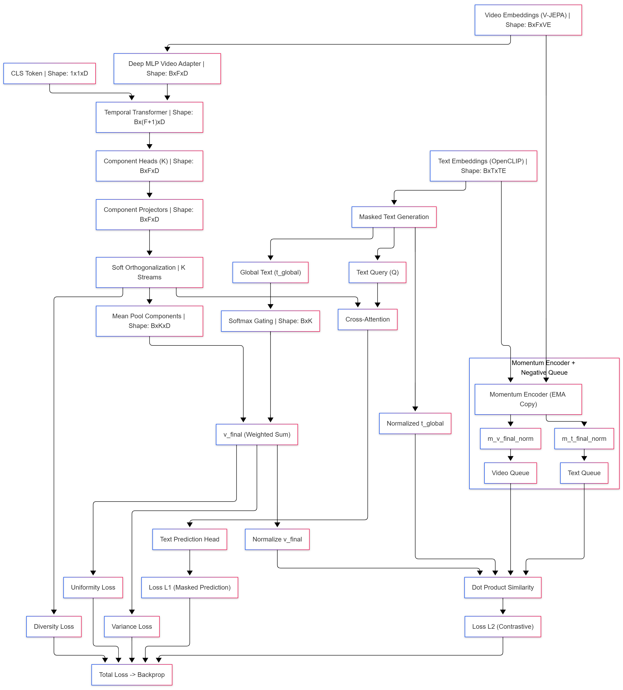
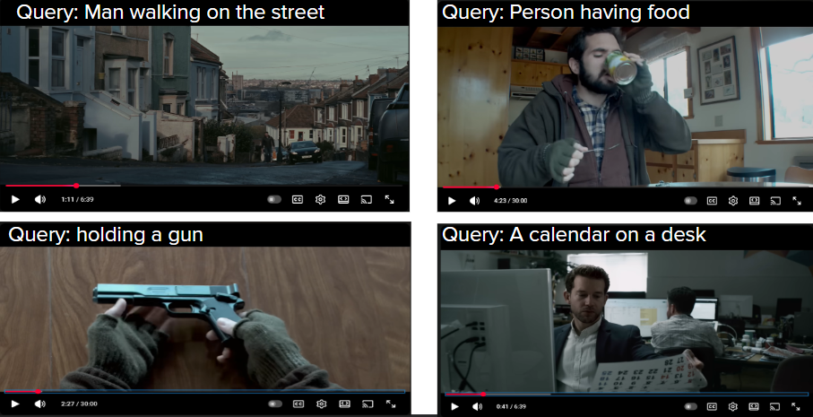
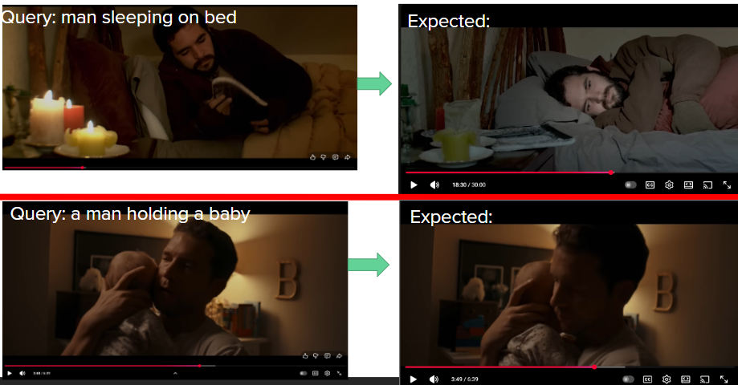

# V-DeClip
### Introducing Masked Multi-Component Gated Decomposition for Video–Text Alignment

## Project Overview
V-DeClip is a video–text alignment framework that integrates predictive video representations from V-JEPA with token-level language embeddings from OpenCLIP, introducing a new Masked Multi-Component Gated Decomposition (MCGD) architecture.
The objective is to learn fine-grained, semantically decomposed video embeddings that match natural-language descriptions with high precision.

Traditional CLIP-style systems rely on a single global video vector, which often fails to capture the multi-aspect nature of video content. In contrast, V-DeClip decomposes each video into multiple components, encourages decorrelation using soft orthogonalization, and employs text-conditioned softmax gating to fuse these components into a dynamic representation guided by semantic cues from text.

Masked token prediction reinforces text encoding robustness, while a momentum encoder with a negative queue stabilizes contrastive learning and exposes the model to a large set of hard negatives.

Overall, V-DeClip combines:
- Predictive video modeling (via V-JEPA)
- Token-level semantic grounding (via OpenCLIP)
- Component-wise video decomposition and decorrelation
- Text-driven softmax gating for dynamic representation
- Large-scale contrastive retrieval training

These design choices collectively produce stronger cross-modal representations and improve retrieval metrics on datasets such as MSR-VTT.

## Model Architecture

The following section provides a clear and structured explanation of the **V-DeClip architecture**, referencing the accompanying diagram (`architecture_flow.png`). Each block in the system corresponds directly to a module in the implementation.

### **1. Video Pathway (V-JEPA → Multi-Component Decomposition)**

* **Video Embeddings (V-JEPA)**
  Precomputed frame-wise embeddings serve as the visual input. These features capture predictive spatiotemporal structure but require adaptation for alignment.

* **Deep MLP Video Adapter**
  Transforms raw V-JEPA features into a unified embedding space (*dimension D*). This prepares the frame tokens for temporal context modeling.

* **CLS Token Injection**
  A learnable `[CLS]` token is prepended to every video sequence, enabling the temporal transformer to aggregate global video context.

* **Temporal Transformer**
  Models cross-frame temporal dependencies. Outputs one global token (from CLS) and refined frame features.

* **Component Heads (K Streams)**
  Each head produces a different view of the same video frames. These represent latent semantic subspaces (e.g., motion, objects, scene structure).

* **Component Projectors**
  Non-linear refinement applied independently to each component stream.

* **Soft Orthogonalization**
  Ensures component streams are decorrelated by applying a differentiable Gram–Schmidt procedure.

* **Mean-Pooling (Per Component)**
  Collapses each component’s time dimension to obtain K vectors of shape `[B, D]`.

### **2. Text Pathway (OpenCLIP Token Embeddings)**

* **Text Embeddings (OpenCLIP)**
  Token-wise language embeddings serve two roles:

  * Masked token prediction (L1 loss)
  * Global text semantics via mean-pooling

* **Masked Text Generation**
  Randomly hides a subset of tokens to train the model to infer missing semantics.

* **Text Query for Cross-Attention**
  Masked tokens act as attention queries over video components.

### **3. Text-Video Interaction**

* **Cross-Attention**
  The masked text tokens attend to the concatenated component sequences (`K × D`).
  Output is passed through a prediction head for masked token reconstruction.

* **Softmax Gating (From Global Text)**
  A small MLP maps the global text embedding to K gating weights. These weights determine how much each video component contributes to the final video embedding.

* **Weighted Component Fusion**
  Final video embedding = Softmax-weighted sum of K normalized component vectors.

* **Embedding Normalization**
  Both text and video embeddings are L2-normalized before contrastive learning.

### **4. Momentum Encoder + Negative Queue**

* **Momentum Encoder (EMA Copy)**
  Provides slow-moving, stable representations for constructing negative samples.

* **Negative Queue (Video + Text)**
  A FIFO queue storing thousands of embeddings from past batches, enabling hard-negative contrastive training.

* **Dot-Product Similarity**
  Computes similarity between current and queued embeddings to form contrastive logits.

### **5. Loss Functions**

* **Masked Token Prediction (L1)**
  Trains the model to predict masked text tokens from video context.

* **Contrastive Loss (L2)**
  Encourages matched video–text pairs to have higher similarity than negatives.

* **Uniformity Loss**
  Encourages video embeddings to spread uniformly on the hypersphere.

* **Variance Loss**
  Ensures each embedding dimension maintains non-zero variance.

* **Diversity Loss**
  Reduces correlations between component streams to prevent collapse.

* **Final Objective**
  Total loss = Weighted sum of all components → Backpropagation.

### **Architecture Diagram**

Below is the full system architecture visualization:




## V-DeClip Architecture and Component Overview

## 1. Video Representation Pathway

### 1.1 Deep MLP Video Adapter

This module transforms high-dimensional frame-wise V-JEPA embeddings into a more compact representation space shared with text. The adapter helps stabilize the distribution of video features before temporal modeling, ensuring that downstream components receive standardized activations.

### 1.2 Temporal Transformer

The temporal encoder models relationships across frames, capturing motion cues and temporal dependencies. A learnable **CLS token** is appended to aggregate global context from the sequence, which becomes part of each component stream.

### 1.3 Component Heads (K Streams)

Instead of a single global video embedding, the model produces **multiple latent components**, each capturing different semantic or structural aspects of the video. Each head projects frame features into a dedicated subspace, enabling the model to decompose the video representation across several directions.

### 1.4 Component Projectors

A small non-linear projector improves representation capacity within each component stream. These projectors refine the embeddings and help ensure that each component can specialize effectively.

### 1.5 Soft Orthogonalization

To prevent components from collapsing into similar directions, we apply a differentiable Gram-Schmidt process. Soft orthogonalization reduces cross-component correlation and promotes diversity in the learned representations—strengthening the effectiveness of gated aggregation.

### 1.6 Mean-Pooled Components

Each orthogonalized component is mean-pooled across time, producing a compact [B, D] summary. These summaries form the basis for the gated fusion module.

## 2. Text Representation Pathway

### 2.1 OpenCLIP Token Embeddings

Text tokens are encoded using OpenCLIP. These token-wise embeddings preserve fine-grained semantic information and serve as input for masking and cross-attention.

### 2.2 Masked Text Generation

A portion of text tokens is masked following a controlled masking strategy. The model predicts masked tokens using video-conditioned cross-attention, enabling the system to learn fine-grained text-video alignment beyond global matching.

### 2.3 Global Text Vector (t_global)

The text embedding is mean-pooled to form a global semantic summary. This vector is used in two key places:

* as a guidance signal for **cross-attention**
* as input to the **gating network** to determine component relevance

## 3. Cross-Attention Mechanism

The masked text tokens act as queries, while the concatenated video components serve as keys and values. Cross-attention enforces alignment between local video details and masked textual content. This mechanism is responsible for learning a stronger token-level grounding signal beyond contrastive objectives.

## 4. Multi-Component Gating

### 4.1 Softmax Gating

A lightweight MLP predicts a distribution over K components based on t_global. The gating module determines how much each component contributes to the final video representation. This design allows the model to dynamically choose semantic directions conditioned on the input text.

### 4.2 Dynamic Video Embedding (v_final)

The final video embedding is obtained by a weighted sum across all components, where weights come from the gating distribution. This ensures that the video representation adapts to the query text, improving retrieval robustness.

## 5. Momentum Encoder + Queue

### 5.1 Momentum Encoder (EMA)

A slowly-updated encoder maintains stable representations for contrastive learning. This prevents representation drift between video and text when training with large queues.

### 5.2 Negative Queue

Video and text embeddings are stored in large FIFO queues to provide a diverse set of negatives for contrastive loss. This setup follows MoCo-style training and significantly improves retrieval performance by increasing negative sample diversity.

## 6. Loss Functions

### 6.1 Masked Prediction Loss (L1)

Measures reconstruction quality of masked text tokens predicted from video features. Encourages the model to align fine-grained video details with token-level semantics.

### 6.2 Contrastive Loss (L2)

Optimizes global video-text alignment. Both v_final and t_global are normalized and compared against large negative sets, ensuring discrimination across samples.

### 6.3 Uniformity Loss

Encourages embeddings to spread over the hypersphere, preventing the representation space from becoming overly compact.

### 6.4 Variance Loss

Maintains a minimum standard deviation across embedding dimensions. Prevents dimensional collapse and ensures each dimension carries meaningful information.

### 6.5 Diversity Loss

Penalizes high correlation between mean-pooled components. Supports the soft orthogonalization process by further encouraging specialization among components.

### 6.6 Covariance Loss

Minimizes off-diagonal entries of the covariance matrix of v_final. Encourages decorrelated feature dimensions, improving stability during contrastive learning.


## Dataset Preparation

V-DeClip is trained and evaluated on the **MSR-VTT** dataset, following the standard text–video retrieval protocol.  
To maintain full reproducibility, all preprocessing scripts are included in the repository.

MSR-VTT is a large-scale video–text dataset containing:

- **10,000 YouTube video clips** (6–30 seconds each)
- **200,000 natural language captions**
- A mixture of topics including daily life, sports, news, gaming, cooking, travel, documentaries, etc.

Each video is annotated with **multiple captions**, which makes it well-suited for learning robust text–video alignment.

The dataset is officially split into:
- **train/val:** 9,000 videos  
- **test:** 1,000 videos  

We follow the **standard retrieval protocol** used in earlier works like CLIP4Clip and X-CLIP.

### 1. Text Embedding Extraction (OpenCLIP)

We generate **token-level text embeddings** for every caption using **OpenAI CLIP (ViT-B/32)**.  
This allows the model to perform masked-token prediction and enables text-conditioned gating.

Run:
```bash
python3 extractor/text_extractor.py

embeddings/
 ├── msrvtt_text_train_embeds.pth
 └── msrvtt_text_test_embeds.pth

python3 extractor/video_extractor.py

embeddings/
 ├── msrvtt_video_train_framewise.pth
 └── msrvtt_video_test_framewise.pth

```

## Training Pipeline

The V-DeClip training pipeline is designed to jointly learn (1) decomposed video representations,  
(2) masked text reconstruction, and (3) contrastive alignment — all within a single unified loop.  
The process is divided into several well-defined stages.

### 1. Batch Construction
Each batch is created by pairing:
- frame-wise **V-JEPA2** video embeddings `[T, 1024]`
- token-level **OpenCLIP** text embeddings `[L, 512]`

The dataset loader performs:
- temporal truncation/padding of video frames  
- dynamic caption sampling (one caption per video)  
- token-level masking for the prediction task  
- text mean-pooling to obtain a global semantic vector  

This ensures stable shapes while preserving caption diversity during training.

---

### 2. Video Encoding
Video features are passed through a three-stage encoder:

**(a) MLP Adapter**  
Refines V-JEPA features and maps them to the shared latent space `D = field_dim`.

**(b) Temporal Transformer**  
Adds temporal structure via self-attention and injects a dedicated CLS token for global context.

**(c) Multi-Component Heads**  
Instead of generating a single embedding, the model predicts `K` component streams.  
Each component captures a distinct aspect of the clip (appearance, motion, interaction cues, etc.).  
A small projector further refines each component.

---

### 3. Component Regularization
To ensure components represent *different* semantic factors:

- A **soft orthogonalization** step reduces redundancy between components.
- A **diversity term** discourages correlation between component means.
- Variance and covariance regularizers prevent component collapse.

Together, they maintain a factorized representation without forcing strict independence.

---

### 4. Text Processing
Text enters two separate pathways:

**Masked sequence (for reconstruction):**  
Used by a transformer-based cross-attention block to predict the missing token vectors.

**Global caption embedding (for alignment):**  
Produced via mean-pooling over the *unmasked* tokens.  
This vector controls both the gating mechanism and the contrastive objective.

This dual pathway allows the model to learn fine-grained text–video correspondence  
and global-level alignment simultaneously.

---

### 5. Text-Conditioned Gating
The global text embedding is fed to a lightweight MLP that produces `K` gating weights.  
These weights softly combine component streams:

This makes the final video embedding *caption-specific* (“which part of the video should matter for this text?”), improving fine-grained retrieval.

---

### 6. Loss Functions
The model is trained using a multi-part objective:

- **Contrastive Alignment Loss**  
  Matches normalized `v_final` with the normalized text embedding.

- **Masked Text Reconstruction Loss**  
  Predicts masked token embeddings through cross-attention.

- **Uniformity & Variance Regularization**  
  Encourages the embedding space to be well-distributed and non-collapsed.

- **Diversity & Covariance Regularizers**  
  Ensure component streams capture distinct semantics and avoid redundancy.

Each loss is lightweight but complementary — enabling stable optimization.

---

### 7. Momentum Queue for Hard Negatives
A momentum-updated encoder generates stable video/text representations that populate a queue.  
This provides thousands of additional negatives per batch, significantly improving retrieval sharpness.

The queue behaves like MoCo:
- in-batch positives  
- queued negatives  
- momentum-encoder keys for consistency  

This stabilizes contrastive learning at large scale.

---

### 8. Evaluation
During evaluation:

1. All video components are computed once and stored.
2. For each text query, gating weights are computed.
3. These weights dynamically generate a text-specific video embedding.
4. Retrieval is performed via dot-product similarity.

We report R@1 / R@5 / R@10 and Median Rank following the MSR-VTT benchmark protocol.

## Debugging and Diagnostics

V-DeClip includes a dedicated diagnostics module (`model.debug_stats`) designed to provide
fine-grained visibility into the behaviour of each sub-module during training.  
This makes it easier to understand whether the factorization, gating, and alignment mechanisms
are functioning as intended.

### What the Debugger Measures

#### 1. Video Feature Dynamics
- **video_proj_variance** — variance of V-JEPA projections after the MLP adapter  
  Helps detect underfitting (too low) or unstable outputs (too high).
- **transformer_variance_gain** — change in variance before and after the temporal encoder  
  Indicates whether temporal attention is contributing non-trivial information.  

#### 2. Component Quality
- **component_stds** — per-component standard deviations  
  Highlights whether some components collapse to constant vectors.
- **avg_corr_before_ortho** — mean correlation between components before orthogonalization  
- **avg_corr_after_ortho** — same correlation after orthogonalization  
- **ortho_reduction** — how much mutual correlation dropped  
  A high reduction indicates that Gram–Schmidt is successfully separating the semantic factors.

#### 3. Gating Behaviour
- **gate_entropy** — measures how uniformly the softmax weights are spread  
  Low entropy indicates over-specialization (one component dominates).  
  High entropy indicates all components contribute equally.
- **gate_std** — standard deviation of gating weights per batch  
  Useful for detecting “lazy gating,” where the model ignores differences in text queries.

#### 4. Component Contribution to Final Embedding
- **component_contributions** — mean gating weight per component  
  Reveals which component streams are most useful for alignment.

#### 5. Embedding Space Health
- **uniformity** — measures whether final embeddings are evenly distributed  
  Very negative values imply the embedding space is collapsing.
- **variance_loss** — checks whether each embedding dimension maintains enough variance  
  Prevents pathological collapse along certain axes.  
- **momentum_difference** — difference between online and momentum encoder outputs  
  Large values suggest instability in the EMA updates.

### How to Use Diagnostics During Training

1. Every 10 epochs, the training script prints a diagnostic block.  
2. If component correlation does not drop → increase orthogonalization or diversity weight.  
3. If gating entropy is extremely high → gate_projector may need stronger non-linearity.  
4. If component_stds show one dominant component → increase diversity or covariance penalty.  
5. If momentum_difference grows too much → lower momentum parameter (e.g., 0.995 → 0.99).  
6. If uniformity becomes too negative → reduce contrastive temperature or uniformity weight.

### Expected Stats
- **Gate entropy < 0.8**  
  Model is collapsing to a single component for all queries.
- **avg_corr_after_ortho > 0.1**  
  Components are not decomposing and remain redundant.
- **variance_loss ≈ 1.0 for many epochs**  
  Components are losing dimensional spread.
- **momentum_difference > 0.02**  
  EMA keys diverge significantly from online keys.
- **uniformity → very negative**  
  Indicates insufficient separation in embedding space.

V-DeClip is a multi-component model with several interacting sub-systems  
(temporal encoding, component decomposition, gating, masked modeling, and contrastive alignment).  
A small failure in one subsystem often cascades into poor retrieval performance.  
The built-in debugger provides precise scalar summaries that make it possible to  
identify these issues early — without manually probing tensors or writing custom scripts.


## Results and Benchmarks

V-DeClip is evaluated on **MSR-VTT 1k-A**, following the standard text–video retrieval protocol.  
Because V-JEPA and OpenCLIP operate in **two fundamentally different embedding spaces**  
(predictive vs. semantic), this benchmark directly measures how effectively V-DeClip can align  
these heterogeneous modalities.

### Evaluation Protocol Notes
- Only **500 randomly sampled test videos** were used (due to GPU limits).  
- Retrieval is computed using **text → video** matching.  
- Results trend consistently upward with more epochs and full-set evaluation is expected to improve further.


## Quantitative Results (500-sample subset)

| Metric | Score |
|-------|------:|
| **R@1**  | **24.20%** |
| **R@5**  | **48.80%** |
| **R@10** | **57.80%** |
| **MedR** | **6.0** |

Even on a reduced evaluation set, V-DeClip demonstrates strong retrieval alignment given the difficulty  
of bridging *predictive video features* with *semantic text embeddings*.

These scores show that:
- the model retrieves the correct video in the **top-1** nearly a quarter of the time,  
- more than **half of the queries** retrieve the correct video within the top-10,  
- median retrieval rank of **6** indicates stable, non-degenerate alignment.

---

## Qualitative Retrieval Results

#### Example Set 1
<p align="center">
  
</p>

These examples illustrate:
- consistent grounding of **scene semantics**,  
- robustness to lighting, background, and angle changes,  
- high sensitivity to **object interactions** and environment context.

#### Example Set 2
<p align="center">
  
</p>

Performance on these samples shows:
- fine-grained matching of **human activities**,  
- correct mapping of **actor–object relations**,  
- stability across visually similar but semantically distinct scenes.

---

## Interpretation

These results confirm that V-DeClip effectively aligns:
- **V-JEPA’s predictive, temporally structured representations**, with  
- **OpenCLIP’s global semantic text embeddings**.

This makes V-DeClip fundamentally different from classical CLIP-style retrieval systems,  
which begin with *both* modalities already embedded in the same semantic space.

The reported numbers demonstrate that the architecture:
- learns **distinct component streams** that specialize in different aspects of video content,  
- uses **text-conditioned softmax gating** to select relevant components per query,  
- avoids collapse using a combination of **uniformity, variance, diversity, and covariance** losses,  
- benefits from **momentum-based hard negatives** to shape a more discriminative space.


## Notes on Inference Pipeline (Upcoming)

The current release of V-DeClip includes:

- full training code  
- full preprocessing scripts  
- full evaluation pipeline for MSR-VTT text–video retrieval  

However, the **general-purpose inference pipeline** —  
for running *custom videos* and *arbitrary text queries* outside MSR-VTT —  
is **not yet included** in this public version.

This module will provide:

- on-the-fly V-JEPA frame extraction for any uploaded video  
- OpenCLIP text encoding for free-form queries  
- multi-component decomposition + gated fusion  
- ranked retrieval with similarity visualization  


## License
Copyright (c) 2025 Surya Narayan  
All Rights Reserved.

This repository and all associated source code, model definitions,
training scripts, preprocessing pipelines, documentation, diagrams,
and design concepts (collectively referred to as “V-DeClip”) are the
exclusive intellectual property of the author.

Permission is granted to view and reference the contents of this
repository strictly for personal learning and academic study only,
**until further notice by the author**.

The following actions are strictly prohibited without prior written
permission from the author:

1. Copying, reproducing, or redistributing this repository or any part
   of its contents, in any form.

2. Modifying, adapting, translating, reverse-engineering, or creating
   derivative works based on this repository, including the model
   architecture, design ideas, loss functions, or training methodology.

3. Using this repository, or any portion of it, in external projects,
   research papers, publications, preprints, coursework, or software
   products.

4. Uploading, mirroring, or distributing this project on any other
   public or private platform, or integrating it into open-source or
   proprietary systems.

5. Training, fine-tuning, deploying, or commercializing any model that
   replicates or reuses the architectural ideas, components, or
   algorithms implemented here.

All rights not expressly granted are reserved. Unauthorized use,
reproduction, distribution, or adaptation of this work is strictly
prohibited and may result in legal action.

By accessing or using any part of this repository, you agree to comply
with these terms until further notice by the author.

